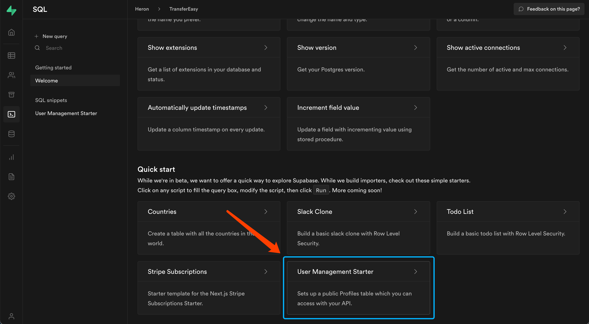

# Figma Plugin with Supabase


This repository shows how to integrate [Supabase](https://supabase.io/) into figma plugin. Often we can use [supabase-js](https://github.com/supabase/supabase-js) in JavaScript project and the API is easy to use. Less code can do a lot. But, in Figma plugin the `localStorage` is not available, so we need to use [`clientStorage`](https://www.figma.com/plugin-docs/api/figma-clientStorage/) instead, which means we can't use supabase-js in Figma plugin because it need `localStorage`.

That's why I create this repository. In this template you can still use the same API to insert data or upload files, the difference is that you need to handle storing auth data in local. The core code is in [src/app/utils/supabase.ts](https://github.com/leadream/figma-plugin-with-supabase/blob/master/src/app/utils/supabase.ts) if you're interested.

## Demo
https://twitter.com/leadream4/status/1439514151710179332

## Prerequisites
* In your Supabase dashboard SQL editor, select this template and run it to create profiles table and avatars bucket.


* Create a `.env` file in root and write your `SUPABASE_URL`, `SUPABASE_ANON_KEY` inside.
```
SUPABASE_URL=YOUR_URL
SUPABASE_ANON_KEY=YOUR_KEY
```

* Remember to set avatars bucket as public.

## Quickstart
* Run `yarn` to install dependencies.
* Run `yarn build:watch` to start webpack in watch mode.
* Open `Figma` -> `Plugins` -> `Development` -> `New Plugin...` and choose `manifest.json` file from this repo.

⭐ To change the UI of your plugin (the react code), start editing [App.tsx](./src/app/pages/App.tsx).  
⭐ To interact with the Figma API edit [controller.ts](./src/plugin/controller.ts).  
⭐ Read more on the [Figma API Overview](https://www.figma.com/plugin-docs/api/api-overview/).

## Toolings
This repo is using:
* React + Webpack
* TypeScript
* Prettier precommit hook

## TODO
- [ ] signUp API
